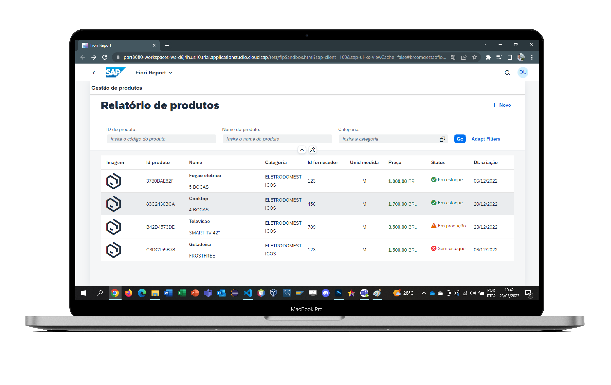
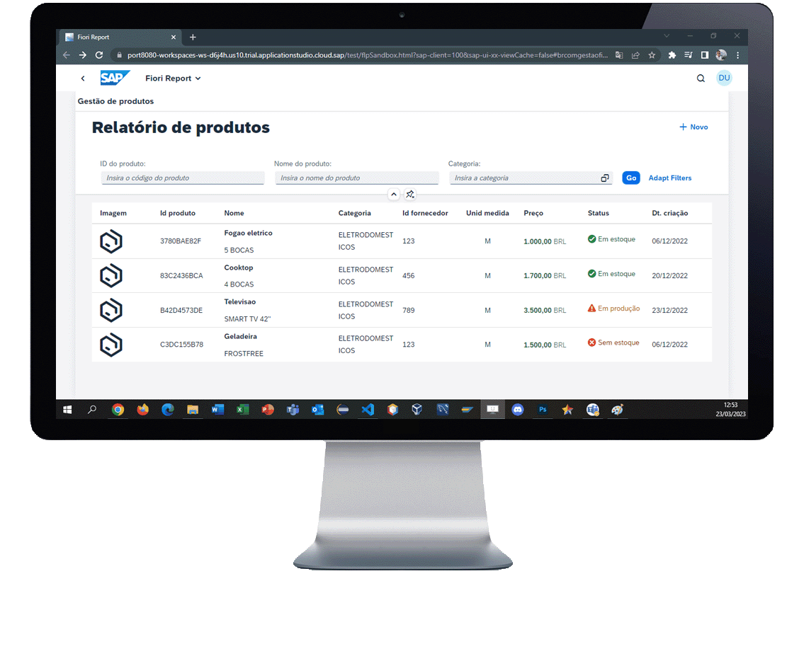

<h1 align="center"> Fiori App Admin </h1>

    <a title="Sobre" href="#-sobre">Sobre</a>&nbsp;&nbsp;•&nbsp;&nbsp;
    <a title="Funcionalidades" href="#%EF%B8%8F-funcionalidades">Funcionalidades</a>&nbsp;&nbsp;•&nbsp;&nbsp;
    <a title="Detalhes da aplicação" href="#-Detalhes-da-aplicação">Detalhes da aplicação</a>&nbsp;&nbsp;•&nbsp;&nbsp;
    <a title="Funcionamento" href="#-funcionamento">Funcionamento</a>&nbsp;&nbsp;•&nbsp;&nbsp;
    <a title="Path" href="#-acesso-ao-projeto">Path</a>&nbsp;&nbsp;•&nbsp;&nbsp;
    <a title="Autor" href="#-desenvolvedor">Autor</a>

    &nbsp;
    &nbsp;
    

 

    

### Status: Em desenvolvimento

## 🔎 Sobre

Este é um projeto para estudo e testes de conhecimentos. Consiste em buscar dados do ECC através de CDS view e listá-los na tela em forma de relatório, dando ao usuário as opções de criar um produto, editar ou deletar. Em breve será publicado para ser acessado de qualquer plataforma.

## ⚒️ Funcionalidades

* Listar produtos cadastrados no banco de dados na tela inicial do aplicativo.

* Disponibilizar um botão para o usuário criar um novo produto.

* Disponibilizar um botão para o exportar o relatório para excel.

* Fornecer navegação entre views para mostrar uma tela de detalhes para cada produto.

* Na tela de detalhes, dar a possibilidade de o usuário editar e excluir um produto.

## 🚀 Detalhes da aplicação
|               |
| ------------- |
|**Generation Date and Time** Wed Nov 16 2022 17:53:42 GMT+0000 (Coordinated Universal Time)|
|**App Generator** @sap/generator-fiori-freestyle|
|**App Generator Version** 1.8.1|
|**Generation Platform** SAP Business Application Studio|
|**Template Used** simple|
|**Service Type** SAP System (ABAP On Premise)|
|**UI5 Theme** sap_horizon|
|**UI5 Version** 1.102.1|

## 📷 Funcionamento

    

## Pré-requisitos:

Active NodeJS LTS (Long Term Support) version and associated supported NPM version (See https://nodejs.org).

## 📂 Acesso ao projeto 

Acesse a pasta do projeto clicando <a href="https://github.com/mmmello/fiori_add_admin/webapp">aqui</a>.

## 💻 Desenvolvedor
Matheus Mello, 2022
 
 

<i><h4 align="center">"Investir em conhecimento sempre renderá os melhores juros" 💭</h4></i>